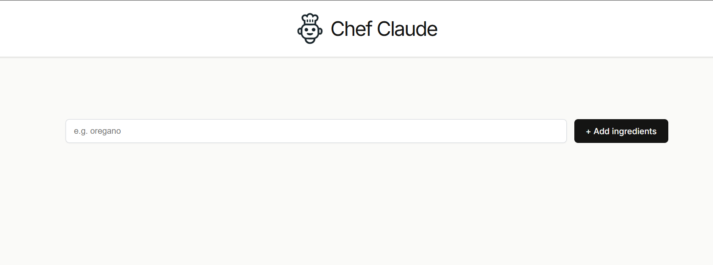
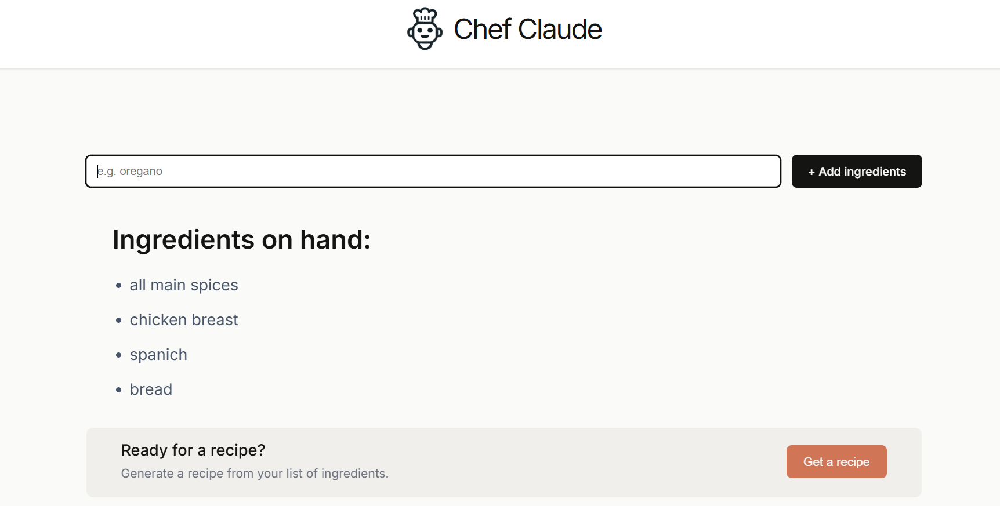
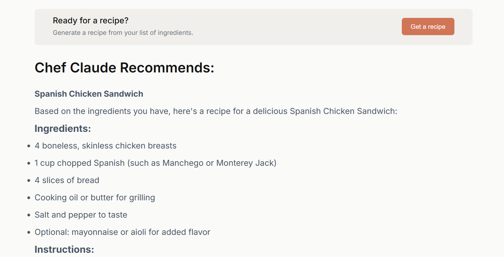
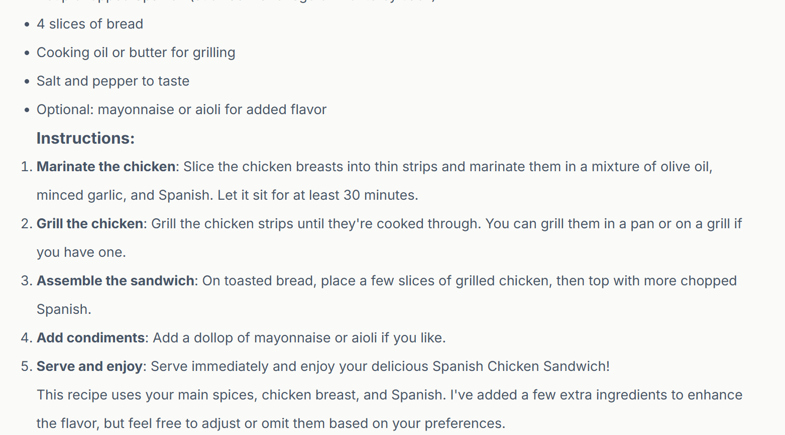

# Chef Claude AI

An AI-powered recipe generator built with **React** that suggests recipes based on the ingredients you already have. Simply enter your available ingredients, and the AI will generate a personalized recipe formatted in Markdown for an easy reading experience.

## ✨ Features

- Generate recipes from available ingredients
- AI-powered recipe suggestions using **Groq**
- Fast responses with **Llama 3.1 8B Instant**
- Markdown-formatted recipes
- Clean and responsive React UI
- Add ingredients dynamically

## 🛠️ Tech Stack

- React
- JavaScript (ES6+)
- Vite
- Groq API
- Llama 3.1 8B Instant
- React Markdown

## 📸 Preview



## 📚 What I Learned While Building This

Building this project gave me practical experience with modern React development and integrating AI APIs into a real-world application. Some of the key concepts I learned include:

- Building reusable React components and managing component state.
- Handling user input and rendering dynamic lists.
- Working with asynchronous JavaScript using `async`/`await`.
- Making API requests to Large Language Models (LLMs).
- Setting up and using environment variables with Vite (`import.meta.env`).
- Managing API keys securely during local development.
- Rendering AI-generated Markdown using React Markdown.
- Debugging API integration issues and reading browser console errors.
- Comparing different AI providers (Hugging Face and Groq) and understanding the trade-offs between response speed, model availability, and deployment considerations.
- Using Git and GitHub to track project progress with meaningful commits.
- Understanding why frontend applications should not expose secret API keys in production and how a backend or serverless function can solve this.

## 🚀 Getting Started

### 1. Clone the repository

```bash
git clone https://github.com/<your-username>/<your-repository>.git
cd <your-repository>
```

### 2. Install dependencies

```bash
npm install
```

### 3. Create a `.env` file

Create a `.env` file in the project root and add your Groq API key:

```env
VITE_GROQ_API_KEY=your_groq_api_key_here
```

You can generate a free API key from:
https://console.groq.com/

### 4. Start the development server

```bash
npm run dev
```

Open the URL displayed in your terminal (usually `http://localhost:5173`).

## 📂 Project Structure

```
src/
│
├── components/
│   ├── ClaudeRecipe.jsx
│   ├── IngredientsList.jsx
│   └── ...
│
├── ai.js
├── App.jsx
├── Main.jsx
└── main.jsx
```

## 💡 How It Works

1. Enter the ingredients you have.
2. Click **Get a Recipe**.
3. Your ingredients are sent to the Groq API.
4. The **Llama 3.1 8B Instant** model generates a recipe.
5. The recipe is displayed beautifully using Markdown.

## 🔒 Security

This project currently uses the Groq API directly from the frontend for learning and development purposes.

For production deployments, API requests should be routed through a backend or serverless function to keep API keys secure.

## 🤝 Contributing

Contributions, suggestions, and improvements are always welcome!

1. Fork the repository
2. Create a new branch
3. Commit your changes
4. Open a Pull Request

## 📄 License

This project is licensed under the MIT License.

---
